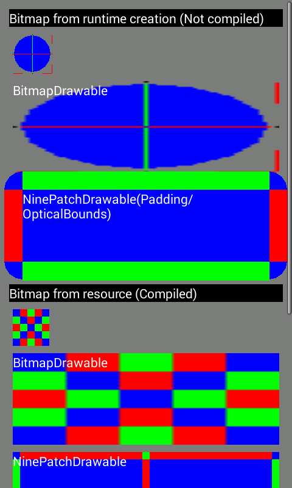
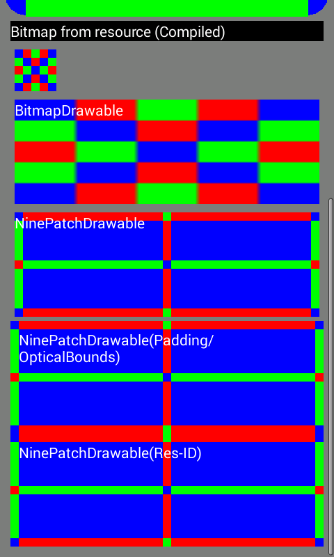

Android - NinePatchDrawableFactory
==================================

Create a NinePatchDrawable object.

**Input source**

* Bitmap from runtime creation (Not compiled)  
* Bitmap from resource (Compiled)  

**Support**

* Stretchable area
* Content area (padding)
* Optical bounds (Android 4.3 or later) - *Using Java reflection*

How to link
===========

**As library**

Eclipse -> Project -> Properties -> Android -> [Library] -> [Add] -> "NinePatchLib"

**As source**

Copy "NinePatchDrawableFactory.java" to your project.

How to use
==========

    import android.graphics.drawable.NinePatchDrawableFactory;

    Resources res = getResources();
    Bitmap bmp = ...
    String srcName = null;

    NinePatchDrawable nd = NinePatchDrawableFactory.convertBitmap(res, bmp, srcName);

Screen shot
===========

License
=======

Copyright (C) 2013 MorihiroSoft

Licensed under the Apache License, Version 2.0 (the "License");
you may not use this file except in compliance with the License.
You may obtain a copy of the License at

<http://www.apache.org/licenses/LICENSE-2.0>

Unless required by applicable law or agreed to in writing, software
distributed under the License is distributed on an "AS IS" BASIS,
WITHOUT WARRANTIES OR CONDITIONS OF ANY KIND, either express or implied.
See the License for the specific language governing permissions and
limitations under the License.
